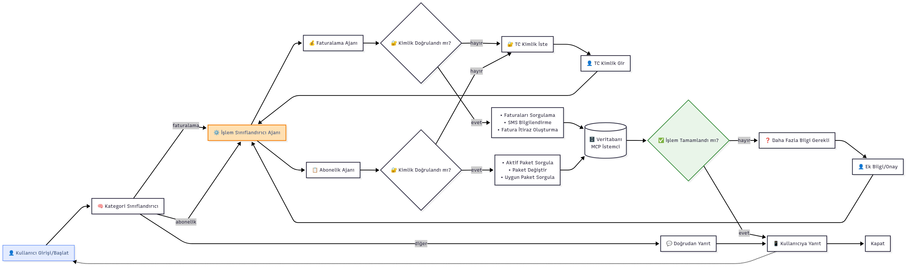

<<<<<<< HEAD
# TDD--TEKNOFEST
=======
# Kermits - TDDI 2025 - Customer Service AI Agent



A sophisticated AI-powered customer service system built entirely with **open-source technologies**. Provides intelligent routing, automated responses, and seamless integration with MCP services using LangGraph workflows and GEMMA 3 LLM.

## 📋 Table of Contents

- [🏗️ Architecture Overview](#️-architecture-overview)
  - [1. LLM-Driven Workflow](#1-llm-driven-workflow-100-ai-decision-making)
  - [2. Hybrid Workflow](#2-hybrid-workflow-llm-planning--software-execution)
- [🚀 Key Features](#-key-features)
- [🌟 Open Source Technology Stack](#-open-source-technology-stack)
  - [Core Framework](#core-framework)
  - [AI & Machine Learning](#ai--machine-learning)
  - [Data Storage](#data-storage)
  - [Infrastructure](#infrastructure)
  - [MCP Services](#mcp-model-control-protocol-services)
- [📋 System Requirements](#-system-requirements)
- [🛠️ Installation](#️-installation)
  - [1. Clone the Repository](#1-clone-the-repository)
  - [2. Python Environment Setup](#2-python-environment-setup)
  - [3. Install Dependencies](#3-install-dependencies)
  - [4. Environment Configuration](#4-environment-configuration)
- [🗄️ Database Setup](#️-database-setup)
  - [PostgreSQL Database Restoration](#postgresql-database-restoration)
  - [Qdrant Vector Database Setup](#qdrant-vector-database-setup-docker)
- [🚀 Running the System](#-running-the-system)
  - [1. Start Database Services](#1-start-database-services)
  - [2. Verify Database Connections](#2-verify-database-connections)
  - [3. Run the Main Application](#3-run-the-main-application)
- [💬 Example Conversation Flows](#-example-conversation-flows)
  - [Subscription Management](#subscription-management)
  - [Billing Management](#billing-management-example)
- [📂 Project Structure](#-project-structure)
- [📖 API Documentation](#-api-documentation)
  - [MCP Operations](#mcp-operations)
- [🤝 Contributors](#-contributors)

## 🏗️ Architecture Overview


The system features **two distinct workflow patterns**:

### 1. **LLM-Driven Workflow** (100% AI Decision Making)
- **GEMMA 3 27B model** - Open source model chosen for this project
- Makes ALL decisions: parameter extraction, next actions, user input requirements, response generation
- Pure AI reasoning for maximum flexibility and natural conversation flow
- Self-managing conversation state and context

### 2. **Hybrid Workflow** (LLM Planning + Software Execution)
- **LLM decides** the strategy and approach
- **Software executes** the technical operations
- Structured tool usage with deterministic execution
- Better for complex multi-step operations

<p class="callout info">Main Flow</p>

## 🚀 Key Features

- **Intelligent Request Classification**: Multi-category routing (subscription, billing, technical*, registration*, FAQ)
- **Vector-Based FAQ System**: RAG-powered knowledge base with semantic search
- **Multi-Agent Architecture**: Specialized agents for different service domains connected with LangGraph
- **SMS Integration**: Automated SMS notifications via Twilio
- **Authentication System**: Secure TC Kimlik-based customer verification using MCP
- **Comprehensive Database**: PostgreSQL with full customer service data model
- **Real-time Embeddings**: Qdrant vector database for semantic search and vector storage running locally

<p class="callout warning">Technical and Registration modules are MCP Server Ready but not integrated yet</p>

## 🌟 Open Source Technology Stack


This system is built entirely with **open-source technologies**:

### Core Framework
- **🐍 Python 3.13.2**: Core runtime environment
- **🔗 LangGraph**: Open-source workflow orchestration framework
- **📡 LangChain**: Open-source LLM application framework

### AI & Machine Learning
- **🧠 GEMMA 3 27B**: Google's open-source language model (`models/gemma-3-27b-it`)
- **🤗 Sentence Transformers**: Open-source embedding models
  - Model: `intfloat/multilingual-e5-large-instruct`
  - Vector Dimensions: 1024
  - Multilingual support with excellent Turkish language capabilities

### Data Storage
- **🗄️ PostgreSQL 13+**: Open-source relational database
- **🔍 Qdrant**: Open-source vector database (running locally via Docker)
  - Collection: `turkcell_sss`
  - Distance Metric: Cosine similarity
  - Local deployment for data privacy

### Infrastructure
- **🐳 Docker**: Open-source containerization platform
- **📱 Twilio API**: SMS integration service

### MCP (Model Control Protocol) Services
- **Authentication Service**: TC Kimlik verification
- **Subscription Management**: Active plans and plan modifications
- **Billing Operations**: Invoice management and disputes
- **Technical Support**: Appointment scheduling (MCP Ready)
- **Registration Service**: New customer onboarding (MCP Ready)

## 📋 System Requirements

### **Software**
- **Python**: `3.13.2` *(exact version required)*
- **PostgreSQL**: `12` or higher  
- **Qdrant**: Latest version *(recommended to run via Docker)*
- **Docker**: Required for hosting the Qdrant vector database  

### **Hardware**
- **GPU Memory (VRAM) Requirements for Gemma 3 27B**:
  - **BF16 (16-bit)**: ~46.4 GB  
  - **SFP8 (8-bit)**: ~29.1 GB  
  - **Q4_0 (4-bit)**: ~21 GB  

<p class="callout info">VRAM requirements listed above are for model loading only. Running with large context windows (e.g., 128K tokens) will require significantly more memory.</p>

## 🛠️ Installation

### 1. Clone the Repository

```bash
git clone <repository-url>
cd TDDI
```

### 2. Python Environment Setup

**Important**: This project requires **Python 3.13.2** specifically.

```bash
# Verify Python version
python3 --version  # Should show Python 3.13.2

# Create virtual environment
python3 -m venv venv

# Activate virtual environment
# macOS / Linux:
source venv/bin/activate

# Windows (PowerShell):
venv\Scripts\Activate.ps1

# Windows (CMD):
venv\Scripts\activate.bat
```

### 3. Install Dependencies

```bash
pip install -r requirements.txt
```

### 4. Environment Configuration

Create a `.env` file in the **project root** directory:

```env
# Database Configuration
DB_HOST=localhost
DB_PORT=5432
DB_NAME=turkcell_db
DB_USER=turkcell_user
DB_PASSWORD=your_secure_password

# GEMMA API Configuration
GEMMA_API_KEY=your_google_api_key
GOOGLE_API_KEY=your_google_api_key

# Qdrant Vector Database
QDRANT_HOST=localhost
QDRANT_PORT=6333

# Twilio SMS Configuration
TWILIO_ACCOUNT_SID=your_twilio_account_sid
TWILIO_AUTH_TOKEN=your_twilio_auth_token
TWILIO_FROM_NUMBER=your_twilio_phone_number
TWILIO_TO_NUMBER=demo_phone_number

# Application Settings
DEBUG=True
LOG_LEVEL=INFO
```

<p class="callout success">On macOS/Linux, always use `python3` and `pip3` to avoid conflicts with system Python. On Windows, use `python` and `pip` if your environment variables are set correctly.</p>

## 🗄️ Database Setup

### PostgreSQL Database Restoration

The project includes a complete database backup file that can be restored using pgAdmin.

#### Step 1: Install PostgreSQL

**Option A: Docker**
```bash
# Start PostgreSQL container
docker run --name tddi-postgres \
  -e POSTGRES_DB=turkcell_db \
  -e POSTGRES_USER=turkcell_user \
  -e POSTGRES_PASSWORD=your_secure_password \
  -p 5432:5432 \
  -d postgres:13
```

**Option B: Local Installation**
- Download and install PostgreSQL from [official website](https://www.postgresql.org/download/)
- Create database and user as shown in environment configuration

#### Step 2: Database Restoration via pgAdmin

1. **Open pgAdmin** and connect to your PostgreSQL server
2. **Create Database**: Right-click on "Databases" → "Create" → "Database"
   - Database name: `turkcell_db`
   - Owner: `postgres`
3. **Restore Database**: Right-click on `turkcell_db` → "Restore"
   - Format: `Custom or tar`
   - Filename: Browse and select `database/turkcell_backup.backup` (included in project)
   - Click "Restore"

**📁 Database File**: The complete database backup `turkcell_backup.backup` is included in the `database/` folder and contains:
- Customer data tables
- Subscription and billing information  
- Technical support records
- Complete schema with indexes and relationships

#### Step 3: Verify Database Setup

```bash
# Test database connection
python database/database.py
```

### Qdrant Vector Database Setup (Docker)

Qdrant runs as a Docker container for optimal performance:

```bash
# Start Qdrant container
docker run --name tddi-qdrant \
  -p 6333:6333 \
  -p 6334:6334 \
  -v $(pwd)/qdrant_storage:/qdrant/storage \
  -d qdrant/qdrant

# Verify Qdrant is running
curl http://localhost:6333/collections
```

## 🚀 Running the System

### 1. Start Database Services

**If running on Docker:**
```bash
# Start PostgreSQL (if using Docker)
docker start tddi-postgres

# Start Qdrant (required for vector search)
docker start tddi-qdrant
```

<p class="callout info">You can run PostgreSQL directly if you have pgAdmin and PostgreSQL installed locally, which can be easier than setting up a Docker container.</p>

### 2. Verify Database Connections

```bash
# Test PostgreSQL connection
python database/database.py

# Test Qdrant connection and collections
python embeddings/vector_store.py

# Verify FAQ embeddings are loaded
curl http://localhost:6333/collections/turkcell_sss
```

### 3. Run the Main Application

#### LLM-Driven Workflow (Terminal with model reasoning steps)

```bash
python workflow.py
```

#### Streamlit UI
```bash
streamlit run ui.py
```

## 💬 Example Conversation Flows

### Subscription Management
```
User: "Hangi paketlerim aktif?"
System: Bu işlem için TC kimlik numaranızı paylaşabilir misiniz?
User: "12345678901"
System: Ahmet Yılmaz Aktif paketleriniz:
- SuperOnline Fiber 100: 199₺/ay - 100GB quota
- BiP Premium: 29₺/ay - Sınırsız mesaj
    Başka nasıl yardımcı olabilirim?
User: "Daha ucuz bir pakete geçmek istiyorum"
System: Mevcut paketlerimiz arasından size uygun seçenekleri göstereyim:
    Fiber Paketler:
    - SuperOnline Fiber 50: 149₺/ay - 50GB
    - SuperOnline Fiber 25: 99₺/ay - 25GB
    
Hangi pakete geçmek istersiniz?
User: "Fiber 50 paketine geçelim"
System: SuperOnline Fiber 100'den SuperOnline Fiber 50'ye geçişinizi
onaylıyor musunuz? Aylık 50₺ tasarruf sağlayacaksınız.
User: "Evet onaylıyorum"
System: ✅ Paket değişikliğiniz başarıyla gerçekleştirildi!
Yeni paketiniz yarın itibariyle aktif olacak.
```

### Billing Management Example
```
User: "Ödenmemiş faturalarım var mı?"
System: TC kimlik numaranızla giriş yapmanız gerekiyor.
Paylaşabilir misiniz?
User: "98765432109"
System: Hoş geldiniz Ayşe Demir!
2 adet ödenmemiş faturanız bulunuyor:
    - Ocak 2024 Faturası: 156₺ (Vade tarihi: 15 Şubat)
    - Şubat 2024 Faturası: 189₺ (Vade tarihi: 15 Mart)
    
    Toplam borç: 345₺
    
    Ödeme için *532*# çevirebilir veya Online İşlemler 
    uygulamasını kullanabilirsiniz.
User: "Ocak faturasında hata var, çok yüksek gelmiş"
System: Fatura tutarına itiraz kaydı oluşturacağım.
İtiraz nedeninizi açıklar mısınız?
User: "Normalde 100₺ civarında ödüyorum, bu ay 156₺ çok yüksek"
System: İtirazınız başarıyla kaydedildi.
Takip numarası: ITR-2024-001234
    48 saat içinde faturanız incelenecek ve size 
    SMS ile bilgilendirme yapılacak.
```

## 📂 Project Structure

```
TDDI/
├── README.md
├── __init__.py
├── __pycache__/
├── database.py
├── db/
│   └── tddi_db
├── embeddings/
│   ├── __init__.py
│   ├── __pycache__/
│   ├── create_embedding_script.py
│   ├── embedding_system.py
│   ├── faq_data.csv
│   └── vector_store.py
├── mcp/
│   ├── __init__.py
│   ├── __pycache__/
│   ├── mcp_client.py
│   └── mcp_config.py
├── nodes/
│   ├── __init__.py
│   ├── __pycache__/
│   ├── billing_executor.py
│   ├── enhanced_classifier.py
│   ├── faq.py
│   ├── safe_executor.py
│   ├── sms.py
│   └── subscription_executor.py
├── services/
│   ├── __init__.py
│   ├── __pycache__/
│   ├── auth_service.py
│   ├── billing_service.py
│   ├── registration_service.py
│   ├── subscription_service.py
│   └── technical_service.py
├── state.py
├── tools/
│   ├── __init__.py
│   ├── __pycache__/
│   └── mcp_tools.py
├── ui.py
├── utils/
│   ├── __pycache__/
│   ├── chat_history.py
│   ├── gemma_provider.py
│   └── response_formatter.py
└── workflow.py
```

## 📖 API Documentation

### MCP Operations

The system provides 16 core operations across 5 categories:

#### Authentication
- `authenticate_customer(tc_kimlik_no)`

#### Subscription Management
- `get_customer_active_plans(customer_id)`
- `get_available_plans()`
- `change_customer_plan(customer_id, old_plan_id, new_plan_id)`

#### Billing Operations
- `get_customer_bills(customer_id, limit)`
- `get_unpaid_bills(customer_id)`
- `get_billing_summary(customer_id)`
- `create_bill_dispute(customer_id, bill_id, reason)`

#### Technical Support (MCP Server Only - Not Implemented)
- `get_customer_active_appointment(customer_id)`
- `get_available_appointment_slots(days_ahead)`
- `create_appointment(customer_id, date, time, team, notes)`
- `reschedule_appointment(appointment_id, customer_id, new_date, new_time)`

#### Registration (MCP Server Only - Not Implemented)
- `register_new_customer(tc_kimlik_no, first_name, last_name, phone, email, city)`

#### Additional Features
- `search_faq_knowledge(question, top_k)`
- `send_sms_message(sms_content)`

## 🤝 Contributors

1. İsmail Furkan Atasoy
2. Abdelrahman Wahdan
3. Semih Burak Atılgan
4. Mehmet Gündoğdu

---
>>>>>>> abdurrahman
